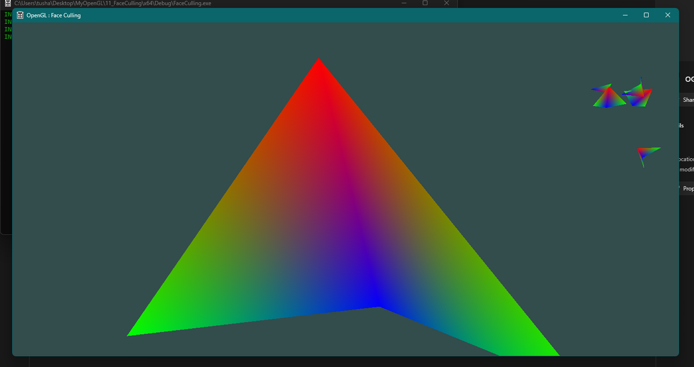
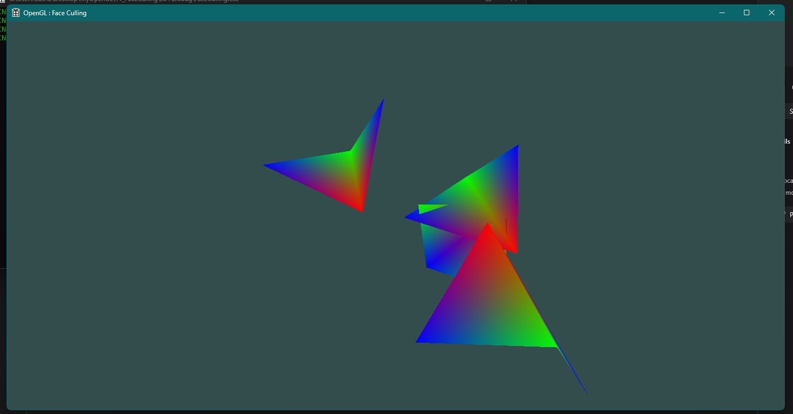
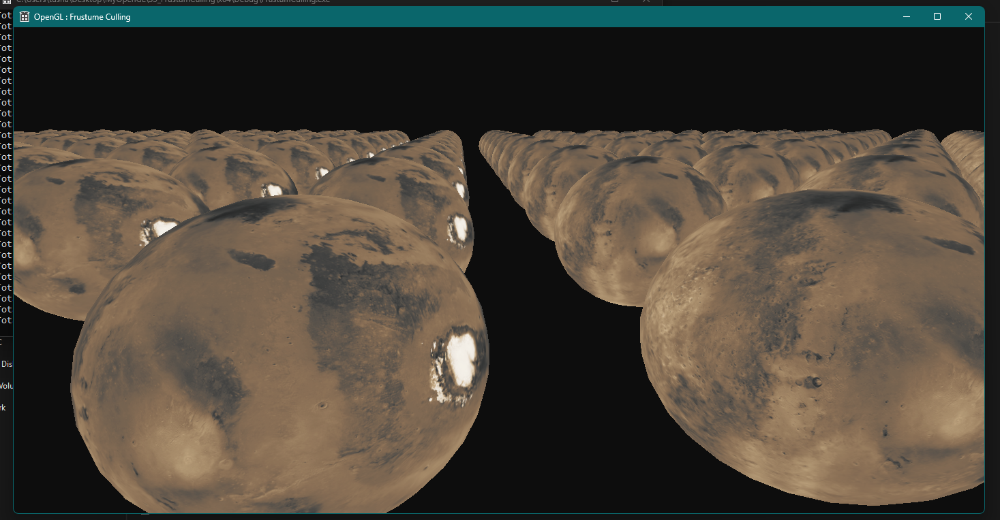
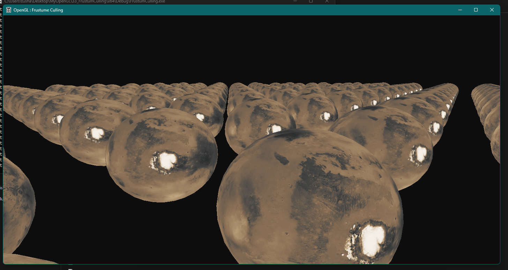

# OpenGL-Culling

## Description

This repository demonstrates the implementation of culling techniques in OpenGL, implemented with C++ and GLSL. It includes two different culling methods: Face Culling and Frustum Culling. Face culling improves rendering efficiency by not rendering back faces, while frustum culling avoids rendering objects outside the camera's view.

## Screenshots






## Folder Structure

*   `01_FaceCulling`: Contains code for the Face Culling implementation.
    *   `FaceCulling/x64/Debug`: Contains build files and output executables.
    *   `resources`: Contains model assets.
    *   `shaders`: Contains GLSL shader programs.
    *   `x64/Debug`: Contains debug build output.
*   `02_FrustumCulling`: Contains code for the Frustum Culling implementation.
    *   `FrustumCulling/x64/Debug`: Contains build files and output executables.
    *   `resources`: Contains model assets.
    *   `shaders`: Contains GLSL shader programs.
    *   `x64/Debug`: Contains debug build output.
*   `.gitignore`: Specifies intentionally untracked files.

## Dependencies

Before building and running this project, you need to install the following dependencies:

*   **GLEW (OpenGL Extension Wrangler Library):** Download GLEW and add the `include` directory and library files (e.g., `glew32.lib`) to your system environment variables.
*   **GLM (OpenGL Mathematics):** Download GLM. GLM is a header-only library, so simply copy the `glm` directory into your project's include path.

**Note:** Adding GLEW and GLM to your system environment variables ensures that Visual Studio can find them during the build process. This typically involves adding paths to the `INCLUDE` and `LIB` environment variables.

## Build Instructions (Visual Studio 2022)

Follow these steps to build the project using Visual Studio 2022:

1.  **Clone the Repository:** Clone this repository to your local machine using the following command:
    ```bash
    git clone https://github.com/Tushar-Wagdare/OpenGL-Culling.git
    ```
2.  **Open the Solution:** Open the `OGL.sln` file in Visual Studio 2022 within either the `01_FaceCulling` or `02_FrustumCulling` folder.
3.  **Build the Solution:** Go to `Build` -> `Build Solution` (or press `Ctrl+Shift+B`).
4.  **Ensure all dependencies are present:** Make sure all the dependencies are installed and placed in the system environment.
5.  **Run the Solution:** After building, run the executable located in the respective `x64/Debug` directory.

## Usage

After successfully building the project, you can run the executable located in the `x64/Debug` directory within either the `01_FaceCulling` or `02_FrustumCulling` folder. Explore the different culling techniques and observe the effect on rendering performance.
